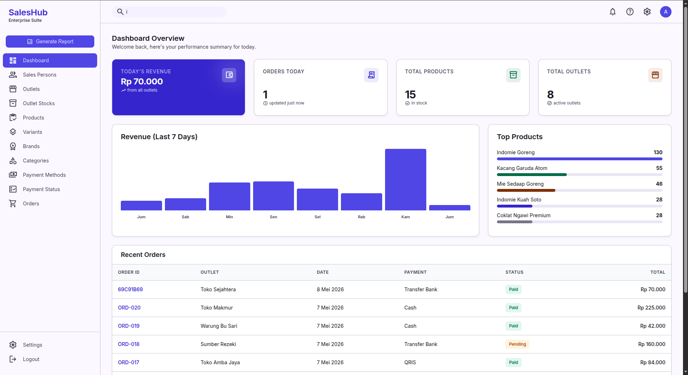
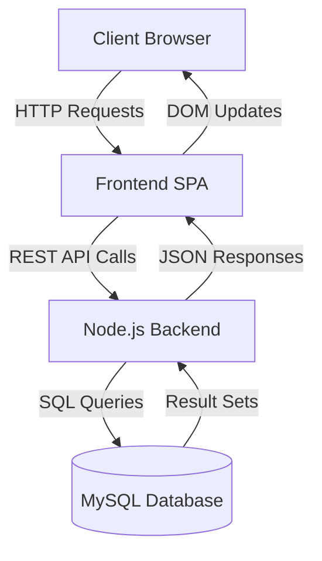
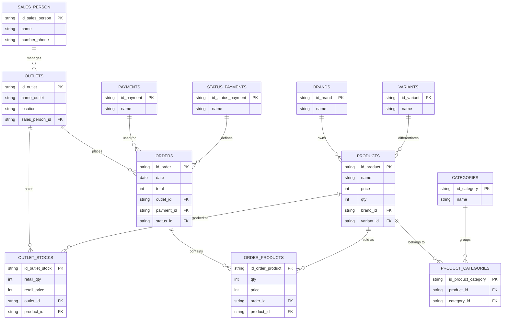

# 📦 SalesHub - Enterprise Order Management System


**SalesHub** is a comprehensive, modern web-based Enterprise Dashboard designed for managing B2B sales data, products, orders, outlets, and personnel. Built with a fast Node.js/Express backend and a responsive Single Page Application (SPA) frontend, it offers a complete solution for wholesale distributors and sales teams to manage their entire operational workflow.

## 📸 Preview



---

## 🚀 Features

- **📊 Dashboard Analytics:** Overview of key metrics, revenue, and total orders.
- **👥 Sales Persons:** Manage staff profiles, assignments, and details.
- **📦 Products & Inventory:** Track products, manage variants, brands, and categories.
- **🏪 Outlets & Stocks:** Register outlet locations and monitor their specific stock levels.
- **🛒 Orders Management:** Comprehensive order creation and tracking system. Computes transactions in real-time.
- **💳 Payments:** Configure payment methods and track payment statuses (Pending, Paid, Cancelled).

---

## 🏗️ Architecture Flowchart

Below is the high-level architecture of how the application components interact with each other.



---

## 🗃️ Database Entity Relationship Diagram (ERD)

The database is heavily normalized to ensure data integrity across master data and transactions.



---

## 💻 Tech Stack

- **Frontend:** HTML5, Vanilla JavaScript, TailwindCSS (via CDN)
- **Backend:** Node.js, Express.js
- **Database:** MySQL 8.0
- **DevOps:** Docker, Docker Compose

---

## 🛠️ Installation & Setup

You can run this project either using **Docker Compose** (Recommended) or manually.

### Method 1: Using Docker Compose (Recommended)

This is the easiest way to run the application, as it automatically provisions the database, phpMyAdmin, and the Node.js backend.

1. **Clone the repository:**
   ```bash
   git clone <your-repository-url>
   cd pbd
   ```

2. **Start the containers:**
   ```bash
   docker compose up -d --build
   ```

3. **Access the Application:**
   - **SalesHub Dashboard:** [http://localhost:3000](http://localhost:3000)
   - **phpMyAdmin:** [http://localhost:8080](http://localhost:8080) (Server: `db`, Username: `root`, Password: `root`)

*(Note: The database schemas will need to be seeded if running for the first time. You can import `schema.sql` and `seed.sql` via phpMyAdmin).*

---

### Method 2: Manual Installation

1. **Clone the repository & Install Dependencies:**
   ```bash
   git clone <your-repository-url>
   cd pbd
   npm install
   ```

2. **Database Configuration:**
   - Create a database named `sales_db` in your local MySQL server.
   - Import the `schema.sql` and `seed.sql` files.
   - Make sure your MySQL is running on `127.0.0.1:3306` with user `root` and password `root` (or define `DB_USER` and `DB_PASSWORD` environment variables).

3. **Start the Server:**
   ```bash
   npm start
   ```

4. **Access the App:** 
   Open your browser and navigate to `http://localhost:3000`.

---

## 📁 Project Structure

```text
.
├── backend/
│   ├── db.js              # MySQL connection pool configuration
│   └── routes/            # Express API endpoints
├── fronted/               # Raw UI components and development files
├── public/                # Served Frontend Single Page Application
│   ├── index.html         # Main SPA entry point
│   ├── styles.css         # Styling and UI rules
│   ├── app.js             # Main frontend logic and routing
│   ├── app-core.js        # Core frontend utilities (API calls, modals)
│   └── app-pages*.js      # Frontend module files for specific pages
├── schema.sql             # Database table structures
├── seed.sql               # Dummy data for testing
├── server.js              # Application entry point and Express configuration
├── docker-compose.yml     # Docker services configuration
├── Dockerfile             # Node.js application image configuration
└── package.json           # Dependencies and scripts
```

---

## 🤝 Contributing
Contributions, issues, and feature requests are welcome! 
Feel free to check [issues page](#).

## 📝 License
This project is licensed under the ISC License.
